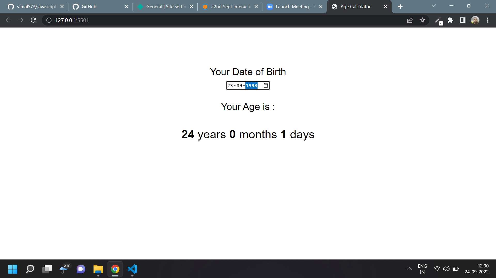

# Javascript Assignment Age Calculator

## Age Calculator [Live Link](https://name-conversion-js.netlify.app/)

- Skills Gained in this project

  - manupulate styles with DOM

  - use Date object to calculate age in years, months and days

---

## Time taken to finish this project

- 1 hour to complete it

#### Screenshot

